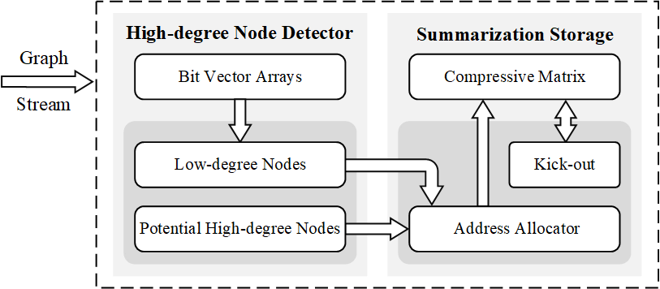
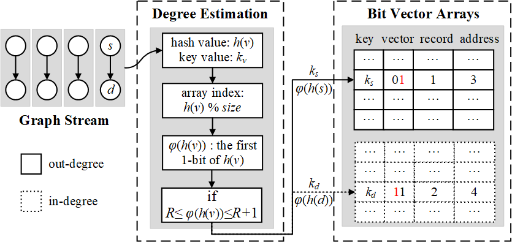
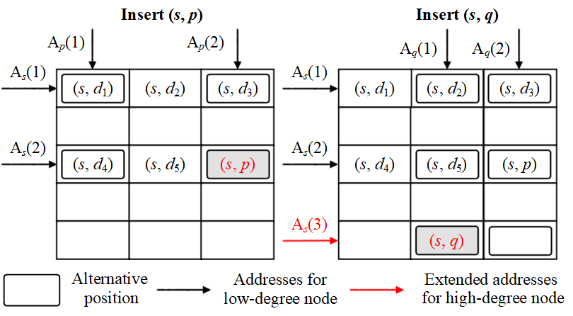
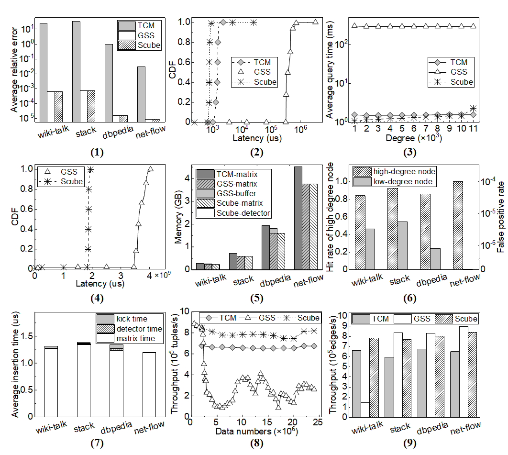

# Scube: Efficient Summarization for Skewed Graph Stream
Scube is an efficient summarization structure for skewed graph stream. Two factors contribute to the efficiency of Scube. First, Scube proposes a space and computation efficient probabilistic counting scheme to identify high-degree nodes in a graph stream. Second, Scube differentiates the storage strategy for the edges associated with high-degree nodes by dynamically allocating multiple rows or columns. We conduct comprehensive experiments to evaluate the performance of Scube on large-scale real-world datasets. The results show that Scube significantly reduces the query latency over a graph stream by 48%-99%, as well as achieving acceptable query accuracy compared to the state-of-the-art designs.

# Introduction
Graph stream, a recent emerging graph data model, represents a fast evolving graph with an infinite stream of elements. Each element in the graph stream is represented as (*si*, *di*,*wi*, *ti*) (*i* > 0), denoting a directed edge *si* → *di* with a weight value *wi* generated at time *ti*. Such a graph data model is widely used in big data applications, such as cybersecurity and surveillance, user behavior analysis in e-commerce networks, and close contact tracking in the epidemic prevention and control.

Emerging big data application systems produce tremendously large-scale and real-time graph stream data. For example, in WeChat, 902 million active users share 38 billion messages every day. Tencent's Health Code platform has more than one billion users who have generated more than 24 billion health code scans during the anti-epidemic campaign of COVID-19. To cope with such large-scale infinite datasets, graph stream summarization becomes a practical technique that attracts lots of recent efforts. 

TCM is the first graph stream summarization structure, which is basically an *m* × *m* matrix *M* with all the buckets initially set to zero. It uses a hash function *h*(·) with the value range [0, *m*) to map an element (*si*, *di*,*wi*, *ti*) of a graph stream to the *h*(*si*)*th* row and the *h*(*di*)*th* column of the matrix by adding *wi* to the value of the corresponding bucket. However, the hash-based scheme can lead to poor query precision due to hash collisions. To improve the accuracy of query results, Gou *et al.* propose GSS which stores the fingerprint of an edge together with its weight value in the corresponding bucket. If a later coming edge with different fingerprint is mapped into the same bucket, GSS inserts it into an extra buffer. A large-scale buffer can lead to a long query latency. 

With hash mapping, existing graph stream summarization structures map the edges associated with the same node into the same row or column of the compressive matrix. Hence, such structures can suffer from poor query precision and long query latency in the presence of skewed graph streams. Based on the observations, we argue that the key to efficient graph stream summarization is to identify high-degree nodes and use a differentiated storage strategy for their associated edges. However, identifying high-degree nodes in a graph stream is not trivial. First, a graph stream evolves fast and the dataset can become tremendously large, raising rigorous requirements of both computation and memory efficiency in designing a node degree estimation scheme. Second, edge duplicating is common in a graph stream, making accurately node degree estimating difficult. 

In this work, we propose Scube, a novel summarization structure for skewed graph streams. Two factors contribute to the efficiency of Scube. First, Scube designs a time and space probabilistic counting scheme to identify the high-degree nodes in graph streams. The proposed scheme only relies on light weight computation on a succinct bit vector. Second, Scube proposes a differentiated strategy for storing the edges associated with high-degree nodes, which uses a dynamic address allocation method to assign more space for high-degree nodes and successfully alleviate hash collisions. 

We implement Scube and conduct comprehensive experiments to evaluate the performance on large-scale datasets collected from real-world systems. The results show that Scube significantly reduces the query processing latency by 48%-99% compared to the state-of-the-art designs while achieving acceptable accuracy. 

# Scube Structure
 

The figure above shows the architecture of Scube, which mainly contains two components, a high-degree node detector and a summarization storage component. With our low-probability events based probabilistic counting, each unit of the arrays consists of three parts: an *L*-bit vector initialized to zero for estimating the degree of a potential high-degree node, the number of times that the vector updates to 2*L* - 1 from zero, and the number of allocated addresses computed by the degree estimation. The summarization storage component is an *m* × *m* compressive matrix *M*. Each bucket in the matrix maintains a pair of fingerprints of an edge and the associated weight value. Initially, Scube allocates two addresses for each node, *i.e.*, four positions of *M* for storing each edge. As high-degree nodes appear, Scube dynamically allocates more addresses and more positions of *M* to store the later coming edges with a high-degree node. When the optional buckets are all occupied, Scube uses a kick-out strategy to guarantee that all edges can be stored in *M*. The number of addresses calculated by the degree estimation may be less than that calculated by the exact degree. Scube explores a feedback mechanism to correct the number of addresses. In the following, we present Scube's low-probability events based probabilistic counting and dynamic address allocation schemes, respectively.

# Low-probability Events Based Probabilistic Counting
 

Degree estimation in a graph stream is challenging in two aspects. First, maintaining the degree of all the nodes is costly in both memory and computation for a large-scale evolving graph stream. Second, it is difficult to eliminate the influence of duplicate edges which are common in a graph stream. 

For a node, we perform independent experiments on its neighbors, *i.e.*, computing the hash values of its neighbors. Assuming that each hash value contains *T* bits, there are a total number of 2*T* different binary strings. We use a limited set of patterns {×...×*T-i*-110...0*i* | 0 ≤ *i* ≤ T - 1} to represent all the hash strings, where 0...0*i* indicates that the consecutive *i* bits are all '0's and × represents '0' or '1'. We can see the number of the patterns is only *T*. For each hash value, the position of its first 1-bit determines which pattern it belongs to, and the probability of the pattern ×...×*T-i*-110...0*i* is 2-(*i*+1). The probability of the pattern with a larger *i* is smaller. A basic idea to estimate the degree is using a *T*-bit vector initially set to zero to record the appearance of all patterns, *i.e.*, the *ith* bit of the vector is set to '1' when the pattern ×...×*T-i*-110...0*i* appears. Then we can deduce the degree expectation based on the probabilities of the patterns appeared. Intuitively, the degree expectation is larger when the vector records 1-bit in the higher digits. To filter most low-degree nodes, Scube only keeps the high digits of the vector to record the patterns with *i ≥ R* (low-probability events) which seldom appear in a few neighbors of a low-degree node, where *R* is the position of the first recorded 1-bit of the hash value. Besides, such a method can filter all the patterns with *i < R* (frequent events), which significantly reduces the computation overhead. Through experimental analysis, we find that the average relative errors are almost the same when the length of the vector exceeds one. Further to reduce the memory cost, Scube only maintains a bit vector with small length *L* finally. We call the process that the vector updates to 2*L*-1 (all bits are '1's) from zero *a complete record*. After each complete record, Scube sets the vector to '0', increases the number of complete records by one, and updates the number of addresses. The final degree estimation is obtained by multiplying the number of complete records by the degree increment expectation of a complete record and adding the estimation based on the current vector.

During one complete record, the duplicate edges only affect the degree estimation once because each bit corresponds to a pattern. If the duplicate edges appear in different complete records, it may affect the final degree estimation multiple times. An observation is that the weight values of the same edges are merged in the same bucket of the matrix *M*. Scube can determine whether the current edge is a duplicate edge by checking the corresponding buckets of *M*. Specifically, during the insertion of each element (*s*, *d*, *w*, *t*), Scube obtains the pair of fingerprints (*fs*, *fd*) and checks all pairs of fingerprints in the corresponding buckets of *M*. If none matches, *s* → *d* is not a duplicate edge, and Scube updates the degrees of *s* and *d* in the detector.

Under the assumption that the hash values of nodes are uniformly distributed, the probability of the pattern ×...×*L-i*-110...0*i* is 2-(*i*+1). 

For convenience, we use *Δd* to denote the exact incremental degree of node *v* when *η* updates to 2*L* - 1 from zero. 
Formally, we have,

*τ*(*Δd*) = 2*R*+*L*Σ[ (-1)*v*(*i*)+1 / *i* ], *i* from 1 to 2*L* - 1.

where *τ*(*Δd*) is the estimation of *Δd* and *v*(*i*) denotes the number of 1-bit in the binary representation of *i*. 

# Dynamic Address Allocation
 

As the high-degree nodes appear, how to differentially store the high-degree and low-degree edges is not trivial. Scube designs a dynamic address allocation scheme on demand, which allocates different numbers of rows or columns to store low-degree edges and high-degree edges. In Scube, all the edges are stored in the compressive matrix *M*.

The figure above shows the process of dynamic address allocation. Initially, all the nodes are regarded as low-degree nodes. Scube uses the linear congruence method to generate two row (resp. column) addresses for each source (resp. destination) node. A row address and a column address determine a position of *M*. That is, Scube allocates four optional positions for inserting all the low-degree edges. At the same time, Scube uses an *F*-bit fingerprint to represent each node and marks each edge with a pair of fingerprints. As the graph stream evolves, high-degree nodes appear. After the detector recognizes a high-degree source (resp. destination) node, Scube generates one more row (resp. column) address and allocates more positions to insert the later edges with this node. If all the corresponding buckets are occupied, Scube leverages a kick-out strategy to guarantee that all the edges can be hosted in the matrix *M*.

# Evaluation Result
 

Here, we show some evaluation results on the dataset *dbpedia*, this dataset is the hyperlink network of Wikipedia, as extracted in DBpedia. Nodes are pages in Wikipedia and edges correspond to hyperlinks (also known as wikilinks). The edges correspond to the <http://dbpedia.org/ontology/wikiPageWikiLink> relationships in DBpedia. This dataset contains 18,268,991 nodes and 172,183,984 edges.

**Edge aggregation weight queries.**
Figure (1) plots ARE of edge queries on the four datasets. The results show that Scube significantly reduces the ARE of edge queries by several orders of magnitude compared to TCM, even though we construct six matrices for TCM. The AREs of Scube and GSS are the same because they use the same hash function and set the same fingerprint length.

**Node aggregation weight queries.**
Figure (2) illustrates the latency distributions of destination node queries on the dataset *dbpedia*. The result shows that Scube greatly outperforms GSS and TCM. Figure (2) shows Scube reduces the latency of TCM by 47.2% while reduces the latency of GSS by 99.8%. 

To examine how the node degree influences the performance of node queries, we divide all the queries into multiple collections according to the node degrees with a granularity of 1,000. Figure (3) depicts the latency of destination node queries with degree division on *dbpedia*. Scube reduces the average latency of GSS by more than two orders of magnitude regardless of the degree. Moreover, we can see that the latency of Scube increases very slowly because the number of allocated addresses increases as the degree increases. 

**Path reachability queries.**
Figure (4) plot the latency distribution of the non-reachability queries on the four datasets, respectively. Here, we only present the results of Scube and GSS, because TCM is useless for path reachability queries. Scube reduces the average latency of GSS by 51.6%.

**Memory cost.**
Figure (5) illustrates the memory cost on the four datasets. We can see the memory cost of Scube is close even lower to that of GSS because the buffer size of GSS is large in the sharply skewed dataset. We can also see the memory cost of the detector is very small (about only 1MB).

**Insert throughput.**
Figure (9) presents the insertion throughput on different datasets. Figure (8) shows the average throughput during the insertion of the dataset wiki-talk. The throughputs of Scube, TCM, and GSS are close in datasets stack, dbpedia, and net-flow. In the sharply skewed dataset wiki-talk, the throughput of GSS drops sharply, which is unacceptable in real-world applications. 

Figure (7) breakdowns the average insertion time of Scube. The insertion time contains three parts, the time to access the detector (detector time), the time of insertion in the matrix (matrix time), and the time to perform the kick-out strategy (kick time). The result shows the detector time and the kick time are very short.

We also examine the accuracy of the high-degree node detector in Scube, mainly including the hit rate of high-degree nodes and the FPR of low-degree nodes. 

Figure (6) shows the HRs and the FPRs in the high-degree node detector of Scube on the four datasets. The results indicate that the identification accuracy of high-degree nodes is high while the FPR is very low. This demonstrates that our low-probability events based probabilistic counting is reliable. 

For more detailed information, please refer to the paper.

# Source Code

The source code of our design Scube is in the folder "ScubeCode", the "README.md" file in that folder shows how to build it and execute the program 'scube.r'. Besides, we also provide the baseline codes, TCM and GSS (in folder BaselineCode), and we also provide the "README.md" file to the folder for illustrating how to build them and run baseline codes.

# Authors and Copyright

Scube is developed in National Engineering Research Center for Big Data Technology and System, Cluster and Grid Computing Lab, Services Computing Technology and System Lab, School of Computer Science and Technology, Huazhong University of Science and Technology, Wuhan, China by Ming Chen (mingc@hust.edu.cn), Renxiang Zhou (mr\_zhou@hust.edu.cn), Hanhua Chen (chen@hust.edu.cn), Hai Jin (hjin@hust.edu.cn).

Copyright (C) 2022, [STCS & CGCL](http://grid.hust.edu.cn/) and [Huazhong University of Science and Technology](http://www.hust.edu.cn).

Licensed under the Apache License, Version 2.0 (the "License");
you may not use this file except in compliance with the License.
You may obtain a copy of the License at

      http://www.apache.org/licenses/LICENSE-2.0

Unless required by applicable law or agreed to in writing, software
distributed under the License is distributed on an "AS IS" BASIS,
WITHOUT WARRANTIES OR CONDITIONS OF ANY KIND, either express or implied.
See the License for the specific language governing permissions and
limitations under the License.